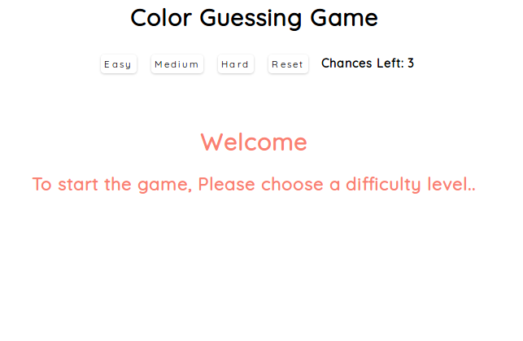

# Overview
    
    Simple rgb color guessing game build using React

### Features

    -Beautiful UI and User Friendly
    -Users can choose from 3 different levels 
    -Users can reset the game anytime
    -Users get 3 chances to guess the correct answer

# Here are Some Screenshots: 

    

  

    

  
           

    

  

# Usage: 

1) Clone the project or download zip

    `git clone https://github.com/ksjc1995/Color-Guessing-Game-React-.git`
    
2) Open the project directory 
    
    `cd directory name`
    
3) Install Dependencies
    
    `npm i`

4) Run the development server
    
    `npm start`

